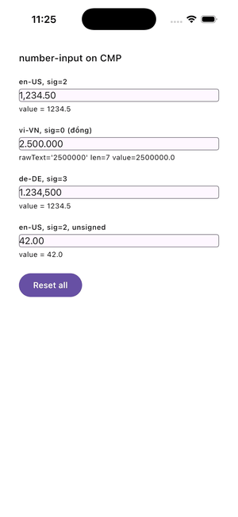
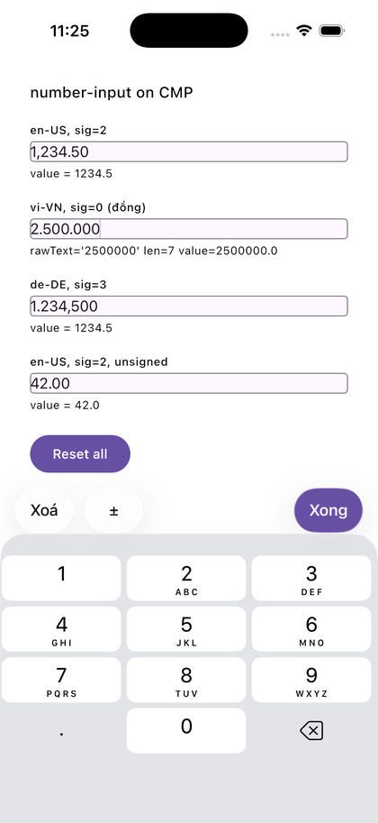

# number-input

[](https://central.sonatype.com/artifact/dev.viethung/number-input)
[](LICENSE)
[](#requirements)

A locale-aware numeric text field for **Compose Multiplatform** (Android + iOS), with live thousands
grouping as you type and a Clear / ± / Done toolbar attached to the keyboard.

<p align="center">
  
  &nbsp;&nbsp;&nbsp;
  
</p>

On iOS the toolbar is a real `UIInputAccessoryView` on a native `UITextField` — not a Compose
imitation floating above the keyboard. On Android it rides the IME animation via `imePadding()`.

## Why

Formatting money in a text field is deceptively fiddly: the caret drifts once you insert separators,
`.` on the decimal keypad is wrong on half the world's locales, and "1.234" means a thousand in Berlin
and one-point-two-three-four in Boston. This handles those cases and keeps the parsed `Double` and the
displayed string in agreement.

- **Live grouping** while typing, using the locale's real separators.
- **Locale-correct decimals** — the keypad always emits `.`, which is translated to `,` on de-DE,
  vi-VN and friends.
- **Caret never jumps** on Android; grouping is a display-only transformation with a proper
  `OffsetMapping`.
- **Fixed decimal precision** with `significantDigits`, including `0` for integer-only currencies
  such as the Vietnamese đồng.
- **Keyboard toolbar** with Clear, sign toggle and Done, enabled/disabled by shared rules on both
  platforms.
- **Follows light/dark** for the parts the library draws itself — the keypad and its toolbar row —
  without a theme to read. Set any of those colours explicitly to opt out.
- **No Material dependency** — `compose.runtime` / `foundation` / `ui` only. Styling comes from
  `NumberInputStyle`, so it drops into any design system.

## Requirements

| | |
|---|---|
| Kotlin | 2.2.20 or newer |
| Compose Multiplatform | 1.9.0 or newer |
| Android | `minSdk` 23, JVM target 11 |
| iOS | `iosArm64`, `iosSimulatorArm64`, `iosX64` |

Kotlin klibs have no forward compatibility, so a consumer on an **older** Kotlin than 2.2.20 cannot
resolve the iOS artifacts at all. The floor is deliberately low; it is not a stale number.

## Installation

```kotlin
// settings.gradle.kts
dependencyResolutionManagement {
    repositories {
        mavenCentral()
        google()
    }
}
```

```kotlin
// shared/build.gradle.kts
kotlin {
    sourceSets {
        commonMain.dependencies {
            implementation("dev.viethung:number-input:2.0.0")
        }
    }
}
```

<details>
<summary>Using a version catalog</summary>

```toml
# gradle/libs.versions.toml
[versions]
numberInput = "2.0.0"

[libraries]
number-input = { module = "dev.viethung:number-input", version.ref = "numberInput" }
```

```kotlin
commonMain.dependencies {
    implementation(libs.number.input)
}
```
</details>

## Quick start

```kotlin
import dev.viethung.numberinput.NumberInputConfig
import dev.viethung.numberinput.NumberInputField
import dev.viethung.numberinput.NumberInputHost

@Composable
fun AmountScreen() {
    var amount by remember { mutableStateOf<Double?>(null) }

    NumberInputHost {
        Column(Modifier.padding(16.dp)) {
            NumberInputField(
                value = amount,
                onValueChange = { amount = it },
                modifier = Modifier.fillMaxWidth(),
                config = NumberInputConfig(
                    significantDigits = 2,
                    locale = "en-US",
                    placeholder = "Enter amount",
                ),
            )
        }
    }
}
```

`value` is a nullable `Double` — `null` means empty, which is distinct from `0.0`.

`onValueChange` fires only on genuine changes, and pushing a new `value` in from the parent is
ignored while the user is mid-edit, so this binds safely to a ViewModel without feedback loops.

## Android setup (required)

The keyboard toolbar cannot track the IME unless the host Activity opts in. A library cannot set
these for you:

```xml
<!-- AndroidManifest.xml -->
<activity
    android:name=".MainActivity"
    android:windowSoftInputMode="adjustResize" />
```

```kotlin
class MainActivity : ComponentActivity() {
    override fun onCreate(savedInstanceState: Bundle?) {
        super.onCreate(savedInstanceState)
        enableEdgeToEdge()          // required for IME insets
        setContent { AmountScreen() }
    }
}
```

Then wrap your screen in `NumberInputHost`, which renders the toolbar bottom-aligned so Compose can
animate it in lockstep with the keyboard.

Without the host the field still works — it falls back to drawing the toolbar inline directly beneath
itself, so the actions stay reachable, but it will not follow the keyboard.

On **iOS** `NumberInputHost` does nothing; the system attaches the accessory view itself. It is
accepted on both platforms so the same code compiles everywhere.

## Hoisted state

To drive the field from a ViewModel or DI graph, own the `NumberInputState` and use the other
overload:

```kotlin
class CheckoutViewModel : ViewModel() {
    val amount = NumberInputState(
        initialValue = 1_234.5,
        config = NumberInputConfig(significantDigits = 2, locale = "de-DE"),
    )
}

@Composable
fun Checkout(viewModel: CheckoutViewModel) {
    NumberInputHost {
        NumberInputField(state = viewModel.amount)
    }
}
```

`NumberInputState` is a plain class holding Compose snapshot state, not a `ViewModel` — the component
is a field, not a screen. Updates are synchronous, so tests need no dispatcher control.

| Member | Meaning |
|---|---|
| `value: Double?` | Parsed value; `null` when empty |
| `rawText: String` | Edit buffer, **always ungrouped**, using the locale's decimal separator |
| `phase: NumberInputPhase` | `Idle` or `Editing` |
| `clear()` / `toggleSign()` | The toolbar actions |
| `syncExternalValue(v)` | Push a value in; ignored mid-edit |

## Configuration

```kotlin
NumberInputConfig(
    significantDigits = 3,       // 0..9, fixed decimals. 0 = integer-only
    locale = "en-US",            // BCP-47 tag driving separators and parsing
    allowNegative = true,        // false disables ± and clamps a negative seed to 0
    placeholder = "",
    useBuiltInKeypad = false,    // true swaps the system keyboard for this library's keypad
)
```

`significantDigits = 0` rejects the decimal separator outright rather than merely capping it — which
is what you want for the Vietnamese đồng:

```kotlin
NumberInputConfig(significantDigits = 0, locale = "vi-VN", placeholder = "Nhập số tiền")
// 2500000 renders as 2.500.000, and "," is refused
```

### Built-in keypad

`useBuiltInKeypad = true` replaces the system keyboard with a keypad drawn by this library, identical on
both platforms. Its decimal key shows **this field's** separator rather than the device region's, so a
de-DE field offers `,` on a US phone instead of a `.` that has to be translated after the fact.

```kotlin
NumberInputConfig(significantDigits = 2, locale = "de-DE", useBuiltInKeypad = true)
```

It is off by default deliberately. The system keyboard is what users expect, and it brings dictation,
paste and every accessibility affordance the OS provides; the keypad trades those for a correct decimal
key and identical behaviour across platforms. Keys grey out exactly when a press would be refused — the
decimal key once a separator is present or on an integer-only field, digits once the fraction is full.

**Wrap the screen in `NumberInputHost`.** The keypad is Compose on both platforms, so unlike the default
iOS toolbar it cannot be attached to the system keyboard and needs the host to sit above the safe area.
The keypad carries its own Clear / ± / Done row, so you never get both it and the toolbar.

Without a host, the two platforms degrade differently: Android renders the keypad inline beneath the
field — usable, but it pushes content down and does not animate — while **iOS falls back to the system
keyboard**, because there is nothing to draw a keypad into and suppressing the keyboard anyway would
leave the field impossible to type in. That fallback gives you the device region's decimal key, which is
the one thing the keypad is there to fix. Values stay correct either way. Use a host.

**Reserve space for it.** The keypad overlays your content, so a field low on the screen would sit
behind it. `Modifier.numberInputKeypadPadding()` is the keypad's counterpart to `Modifier.imePadding()`
— apply it to the **scroll container**, before `verticalScroll`:

```kotlin
Column(
    Modifier
        .fillMaxSize()
        .imePadding()                 // the system keyboard, for your other fields
        .numberInputKeypadPadding()   // this library's keypad
        .verticalScroll(scrollState)
) { /* fields */ }
```

Order matters: padding the container shrinks the viewport, which is what lets a focused field scroll up
out from behind the keypad. Padding the content inside it only adds space below and leaves the obscured
region exactly as it was. The padding is zero unless a keypad is showing, so it costs nothing on the
default path.

If you need the raw figure, `LocalNumberInputKeypadHeight` carries it. It animates in step with the
keypad, so key any `LaunchedEffect` on `LocalNumberInputKeypadTargetHeight` instead — that one changes
once per open rather than once per frame.

## Styling and localisation

```kotlin
NumberInputStyle(
    textColor = MaterialTheme.colorScheme.onSurface,
    textSize = 18.sp,
    borderColor = MaterialTheme.colorScheme.outline,
    cornerRadius = 8.dp,
    toolbar = NumberInputToolbarStyle(
        backgroundColor = MaterialTheme.colorScheme.surfaceVariant,
        tint = MaterialTheme.colorScheme.primary,
        clearLabel = "Xoá",      // defaults are English
        signLabel = "±",
        doneLabel = "Xong",
    ),
)
```

Styling is grouped into three objects: the field's own properties sit on `NumberInputStyle`, the
Clear / ± / Done row on `NumberInputToolbarStyle`, and the built-in keypad on
`NumberInputKeypadStyle`. See [Migrating to 2.0.0](#migrating-to-200) if you are coming from 1.x.

> The toolbar labels default to English and will ship to every user that way. Pass localised strings
> from your own resources.

### Light and dark

Most of `NumberInputStyle` defaults to neutral literals, because the field is yours to theme — this
library depends on `compose.foundation`, not Material, so it has no theme to read.

The colours the library draws *itself* are the exception: the keypad's background and its keys'
fills and glyphs, and the toolbar row's background and tint. There is no design system for a consumer
to bring for a stand-in system keyboard, so those default to `Color.Unspecified` and resolve against
the device's light/dark appearance:

```kotlin
NumberInputStyle()                                  // keypad and toolbar follow the OS appearance
NumberInputStyle(                                   // key fill pinned white in both appearances
    keypad = NumberInputKeypadStyle(
        restKey = NumberInputKeyStyle(backgroundColor = Color.White),
    ),
)
```

Setting any of them opts that one colour out and leaves the rest following the appearance. This is
per-colour, not a mode switch. `Color.Transparent` counts as a deliberate choice; only
`Color.Unspecified` — the default — is treated as unset.

They follow the **device**, not the `MaterialTheme` around them, matching the system keyboard they stand
in for. If your app is dark-only or light-only against the platform setting, set the five explicitly.

The **field's** style surface is deliberately small: every property on `NumberInputStyle` itself maps
to *both* a Compose `BasicTextField` and a UIKit `UITextField`. Anything that would work on only one
platform — gradients, arbitrary shapes, `letterSpacing` — is left out rather than accepted and silently
ignored. That is also why there is no `fontFamily` on `NumberInputStyle`: a Compose `FontFamily`
cannot cross into UIKit, so it would style the field on Android and do nothing on iOS.

The keypad and the toolbar row are Compose on *both* platforms, so they are not bound by that rule —
`NumberInputKeypadStyle.fontFamily` and `NumberInputToolbarStyle.fontFamily` do exist, and work
everywhere. You bundle and register the font; the library only accepts the family it is handed.

## Migrating to 2.0.0

2.0.0 groups styling into three objects. The field's own properties stay on `NumberInputStyle`; the
eight keypad and toolbar properties move. Nothing renders differently — an unstyled keypad in 2.0.0 is
pixel-identical to 1.x. The change is mechanical:

| 1.x | 2.0.0 |
|---|---|
| `toolbarBackgroundColor` | `toolbar.backgroundColor` |
| `toolbarTint` | `toolbar.tint` |
| `clearLabel` / `signLabel` / `doneLabel` | `toolbar.clearLabel` / `.signLabel` / `.doneLabel` |
| `keypadBackgroundColor` | `keypad.backgroundColor` |
| `keyBackgroundColor` | `keypad.restKey.backgroundColor` |
| `keyTextColor` | `keypad.restKey.contentColor` |
| `keyTextSize` | `keypad.restKey.textSize` |
| `keyHeight` / `keyCornerRadius` | `keypad.keyHeight` / `keypad.keyCornerRadius` |
| `backspaceLabel` | `keypad.backspaceLabel` |
| `backspaceContentDescription` | `keypad.backspaceContentDescription` |
| `decimalContentDescription` | `keypad.decimalContentDescription` |

`disabledAlpha` stays where it is.

**One behaviour change.** With `allowNegative = false`, the ± button is now **omitted** from the bar
rather than shown permanently greyed — on the Compose row and iOS's native `UIToolbar` alike. A button
that can never become enabled for the life of the field is dead weight. If a UI test asserted on a
disabled `numberInput.toolbar.toggleSign`, it must now assert absence. (The keypad's decimal key on an
integer-only field is deliberately the opposite call: it stays visible and greyed, because hiding it
would leave a hole in a fixed grid.)

The action order also follows ± → Clear → Done now, on both platforms. Every test tag still resolves;
only the left-to-right positions moved.

**Haptics are on by default.** The built-in keypad ticks on each accepted press. Set
`NumberInputConfig(keypadHaptics = false)` to opt out.

### What 2.0.0 adds

Enough styling surface to reproduce a real design spec without the library carrying any brand value:

- **Per-key roles and states.** `keypad.restKey`, `utilityKey`, `pressedKey` and `disabledKey` are
  four `NumberInputKeyStyle` objects — one per swatch in a typical spec. Unset, `utilityKey` falls back
  to `restKey` and `disabledKey` falls back to dimming by `disabledAlpha`, which is 1.x's rendering.
  Pressed and disabled contribute **colours only**; geometry always stays with the role, so a
  bottom-aligned separator stays bottom-aligned in every state.
- **Grid metrics** (`contentPadding`, `keySpacing`), a **hard shadow lip** (`shadowColor`,
  `shadowHeight` — an offset edge, not an elevation shadow), `fontFamily`, `tabularFigures`, and an
  optional `backspaceIcon` for designs whose brand font lacks U+232B.
- **Accessory-bar chrome**: `NumberInputToolbarActionStyle` for the `action`, `done` and `navigation`
  buttons, plus bar `height`, `contentPadding`, `itemSpacing`, `bottomBorderColor` and label
  typography. Every default is "no chrome", i.e. the bare tinted text 1.x drew.
- **A centred `hint`** on the toolbar style, a **`leadingAccessory`** slot on `NumberInputHost` for a
  brand mark, and **`onPrevious` / `onNext`** field-navigation callbacks on `NumberInputField`.
- **Hold-to-repeat backspace**: 400 ms, then a delete every 80 ms until release or an empty buffer.

`onPrevious` / `onNext` render in the **Compose** row only. iOS's system-keyboard path builds a native
`UIToolbar`, and this library exposes no way to move focus into another `UITextField` — so on iOS they
are usable with `useBuiltInKeypad` and a host, where you drive focus yourself.

## Custom formatting

`LocaleNumberFormatter` is public and injectable. If your app already renders numbers its own way,
supply your implementation instead of inheriting this library's — mixing two strategies in one app
produces visibly inconsistent separators.

```kotlin
class MyFormatter : LocaleNumberFormatter {
    override fun format(value: Double, significantDigits: Int, locale: String): String = TODO()
    override fun parse(rawText: String, locale: String): Double? = TODO()
    override fun formatLive(rawText: String, locale: String): String = TODO()
    override fun decimalSeparator(locale: String): String = TODO()
    override fun groupingSeparator(locale: String): String = TODO()
}

NumberInputState(formatter = MyFormatter(), config = config)
```

The defaults are `DecimalFormat` on Android and `NSNumberFormatter` on iOS.

## Testing

Elements carry stable identifiers — Compose test tags on Android, `accessibilityIdentifier` on iOS:

| Element | Identifier |
|---|---|
| Field | `numberInput.field` |
| Clear | `numberInput.toolbar.clear` |
| Sign toggle | `numberInput.toolbar.toggleSign` |
| Done | `numberInput.toolbar.done` |

These identify the *component*, not the instance, so a screen with several fields addresses them by
index. In an iOS accessibility dump they appear as `AXUniqueId`.

## How it works

Shared logic lives in `commonMain` and is UI-framework-free; each platform only renders.

- **Android** — a `BasicTextField` whose buffer stays ungrouped. `NumberGroupingVisualTransformation`
  inserts separators for display with an `OffsetMapping` built by construction, so the caret never
  drifts.
- **iOS** — a native `UITextField` via `UIKitView`, because only UIKit can attach a real
  `inputAccessoryView` to the keyboard. Its buffer *is* grouped, so the field converts at the
  boundary.

`rawText` is always ungrouped on both platforms; grouping is display-only. `commit()` is reached only
by losing focus, and both platforms route Done through focus loss, so there is a single commit path.

## Building

```bash
./gradlew :number-input:testDebugUnitTest      # commonTest + androidTest on the JVM
./gradlew :number-input:iosSimulatorArm64Test  # commonTest + iosTest on a simulator
./gradlew :number-input:allTests               # every target
./gradlew :number-input:publishToMavenLocal    # consume from another project via mavenLocal()
```

<details>
<summary>Releasing to Maven Central (maintainers)</summary>

Publishing needs credentials that are not in this repo. Put them in `~/.gradle/gradle.properties`:

```properties
mavenCentralUsername=<Central Portal token username>
mavenCentralPassword=<Central Portal token password>

signingInMemoryKey=<ASCII-armoured GPG secret key, newlines as \n>
signingInMemoryKeyPassword=<key passphrase>
```

```bash
./gradlew :number-input:publishAndReleaseToMavenCentral
```

Signing is enabled only when a signing key is present, so `publishToMavenLocal` keeps working on a
machine with no GPG key.
</details>

## License

Apache 2.0 — see [LICENSE](LICENSE).
